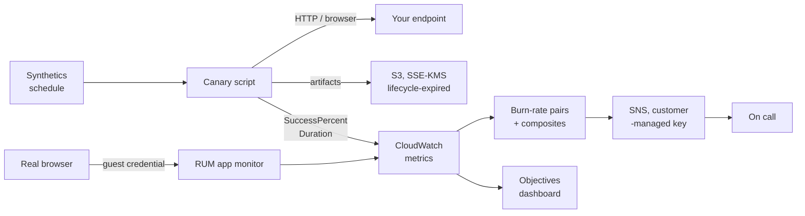

# aws-synthetics-monitoring

Terraform for proactive, outside-in monitoring of an HTTP service on AWS:
scripted CloudWatch Synthetics canaries that exercise real endpoints on a
schedule, real-user telemetry from the browser, and service-level dashboards and
alarms built on top of both.

The premise is that an endpoint nobody is calling is an endpoint whose outage you
learn about from a customer. A canary calls it for you, from outside your VPC,
on a fixed cadence, and fails loudly when the contract breaks — including the
cases a health check never sees, such as a 200 response carrying an error body,
a certificate 10 days from expiry, or a login page that renders but no longer
submits.

## What this repository is

A single root Terraform configuration, not a module library. It is meant to be
copied into an environment directory, pointed at a set of endpoints, and
applied. Every capability is opt-in: with no endpoints configured, a plan
produces only the shared artifacts bucket, its key, and the canary execution
role.

Everything ships as a template with placeholder values. Nothing in this
repository is wired to a live account, and no state, plan file, or tfvars file
with real values is tracked.

## How it fits together



Three layers, each opt-in and each created by naming the thing it observes:
**probes** (canaries calling real endpoints on a schedule), **telemetry** (what
real browsers experienced), and **objectives** (dashboards and alarms derived
from the probe metrics). The two signal sources meet only on the dashboard —
nothing in the alerting path reads real user telemetry, because it is sampled
and publicly writable by construction.

[`docs/architecture.md`](docs/architecture.md) walks through each layer, and
through the shapes that are the way they are because the alternative does not
work.

## Documentation

| Document | Read it for |
|---|---|
| [`docs/architecture.md`](docs/architecture.md) | How the three layers compose, the orderings and cycles that shape the root, and what the design cannot see. |
| [`docs/slo-runbook.md`](docs/slo-runbook.md) | The objective arithmetic, triage for each alarm, and why an alarm can fire and reach nobody. |
| [`canary-scripts/README.md`](canary-scripts/README.md) | What *healthy* means, the bundle layout the service requires, and how to add a check. |
| [`tests/README.md`](tests/README.md) | What the offline suite holds in place, and how the Synthetics runtime is stood in for. |

## Layout

```
.
├── versions.tf              Terraform and provider constraints
├── providers.tf             Provider wiring and the account guard rail
├── main.tf                  Account context data sources
├── variables.tf             Inputs, each with a validation block
├── locals.tf                Naming, tagging, and canary composition
├── canaries.tf              Canaries, artifacts bucket, key, role, and guards
├── outputs.tf               What was created, and what was deliberately not
├── terraform.tfvars.example Template for a real tfvars file
├── .tflint.hcl              Lint configuration used by the pipeline
├── Makefile                 Every gate the pipeline runs, runnable locally
├── docs/                    Architecture and the objectives runbook
└── canary-scripts/          The code the canaries run, and its build
    ├── api-canary.js        HTTP contract check for a single endpoint
    ├── heartbeat-canary.js  Minimal availability check at the fastest cadence
    ├── broken-link-checker.js  Follows a page's links and reports the dead ones
    ├── visual-monitoring.js Screenshot comparison against a stored baseline
    ├── build.sh             Packages the scripts into the bundle the service takes
    └── lib/                 Assertions, config parsing and probing, runtime-free
```

## Configuration

| Input | Default | What it decides |
|---|---|---|
| `aws_region` | `us-east-1` | The vantage point. Canaries observe your endpoints from this region, so it is a monitoring decision, not just a deployment one. |
| `name_prefix` | `synth` | Base of every resource name. Capped at 12 characters because a canary name may not exceed 21 in total. |
| `environment` | `dev` | Appended to the prefix and set as the `Environment` tag. Capped at 8 characters for the same reason. |
| `allowed_account_ids` | `[]` | When non-empty, the provider refuses to act outside this account list. Empty means your credentials are the only guard. |
| `tags` | `{}` | Merged into the provider default tags. Your keys win. |
| `artifact_retention_in_days` | `30` | Lifetime of canary artifacts in the bucket. The main storage cost lever. |
| `create_kms_key` | `true` | Whether this stack owns its encryption key or reuses one you supply. |
| `kms_key_arn` | `null` | Existing key to encrypt artifacts with. Required when `create_kms_key` is `false`. |
| `kms_key_deletion_window_in_days` | `30` | Waiting period before a scheduled key deletion takes effect. |
| `api_endpoint` | `null` | URL the API canary calls. Setting it is what creates that canary. |
| `api_expected_status` | `200` | Status the API canary treats as healthy, passed to the script as an environment variable. |
| `api_canary_schedule_expression` | `rate(5 minutes)` | Cadence of the API canary. |
| `heartbeat_endpoint` | `null` | URL the heartbeat canary loads. Setting it is what creates that canary. |
| `heartbeat_canary_schedule_expression` | `rate(1 minute)` | Cadence of the heartbeat canary. One minute is the service floor. |
| `canary_name_prefix` | `null` | Overrides the prefix for canary names only, which is how a descriptive deployment name coexists with the service's 21-character cap on canary names. |
| `canary_runtime_version` | `syn-nodejs-puppeteer-9.1` | Runtime for every canary that does not override it. Region-scoped and retired on a schedule, so confirm it before pinning. |
| `canaries` | `{}` | Additional canaries keyed by short name. A key of `api` or `heartbeat` replaces that built-in. |
| `canary_code` | `null` | Source of the packaged bundle: `zip_path`, or `s3_bucket` plus `s3_key`. Required once any canary exists. |
| `canary_vpc_config` | `null` | Run canaries inside a VPC. Only for endpoints the internet cannot reach. |

## Canary catalog

| Key | Canary name | Created when | Cadence | Asserts |
|---|---|---|---|---|
| `api` | `<prefix>-api` | `api_endpoint` is set | `rate(5 minutes)` | The endpoint answers with the expected status inside the timeout. The expected status reaches the script as `EXPECTED_STATUS`, so the assertion lives with the check rather than in the infrastructure. |
| `heartbeat` | `<prefix>-hb` | `heartbeat_endpoint` is set | `rate(1 minute)` | The page is reachable at a cadence fast enough to serve an availability objective. Runs with a 20-second timeout and the minimum memory, because a heartbeat that has not answered in 20 seconds is already a problem. |

Anything beyond these two goes in `canaries`, which takes the same shape and
fills unspecified fields from the same defaults.

### The 21-character name budget

Synthetics caps a canary *name* at 21 characters. Nothing else here is capped
that tightly, so canary names are built from their own prefix rather than the
shared one:

```
canary name = coalesce(canary_name_prefix, "<name_prefix>-<environment>") + "-" + name_suffix
```

Two consequences worth knowing before the guard tells you about them:

- The `heartbeat` canary's suffix is `hb`, not `heartbeat`. Spending nine of
  twenty-one characters on the word is what pushes an otherwise ordinary prefix
  over the limit. The map key stays spelled out, because it names the canary's
  artifact prefix in S3, where there is no such cap.
- The input validations on `name_prefix` and `environment` do **not** guarantee
  the budget: the widest combination they allow (12 plus 8 characters) overflows
  it on its own. That is what `canary_name_prefix` is for — set it to something
  short and leave the deployment's own name alone.

### Where the code comes from

The canary scripts live in [`canary-scripts/`](canary-scripts/README.md) and are
packaged separately from this configuration, then pointed at through
`canary_code`. That split is deliberate: the assertions change when the service
changes, at a different pace from the infrastructure around them, and the bundle
is a build artifact with its own lifecycle. Synthetics accepts exactly one code
source per canary, so naming both a local zip and an S3 object is refused at
plan time rather than at apply time.

```bash
./canary-scripts/build.sh        # → canary-scripts/dist/canaries.zip
```

Two further checks ship there beyond the two canaries this configuration creates
on its own — a broken-link crawler and a visual-regression check. Both are wired
in through the `canaries` input; that directory's README shows the block.

### What the guards refuse

`terraform_data.canary_guards` fails the plan, with a sentence explaining each
case, when:

- a canary exists but `canary_code` names no source, or names two;
- `create_kms_key` is `true` while `kms_key_arn` is also set;
- artifacts would be retained beyond 90 days with no customer-managed key;
- `canary_vpc_config` is set but either of its lists is empty;
- an assembled canary name exceeds 21 characters, and points at `canary_name_prefix` as the fix;
- a canary's timeout is longer than the gap between its runs, so runs overlap;
- `active_tracing` is on for a runtime that does not support it.

The guard feeds those values into its `input` rather than holding a static one.
A `terraform_data` resource with unchanging arguments is planned once and then
never again, and preconditions are only evaluated when Terraform plans an action
for the resource — a guard with an empty input quietly stops checking after the
first apply.

## Objectives

Canary metrics are turned into an availability objective with an error budget
and a two-tier severity ladder. The defaults:

| | Default | |
|---|---|---|
| Objective | 99.5% | `slo_objective` |
| Budget period | 30 days | `slo_window_days`, giving a 216-minute budget |
| `fast` tier | 14.4x burn over 60 min, confirmed over 5 min | Breaches below 92.8% success, which is 2% in an hour. Page. |
| `slow` tier | 6x burn over 6 h, confirmed over 30 min | Breaches below 97% success, which is 5% in six hours. Ticket. |

Each tier is two metric alarms and one composite that is in ALARM only while
both windows are breaching — the long one decides whether the objective is in
trouble, the short one decides when to stop saying so. Only the composites
notify.

The objective is 99.5% rather than the more fashionable 99.9% because of
sampling, not ambition. **A canary contributes one sample per run**, so the
finest error rate a window can express is one failure divided by the runs it
holds: a 60-minute window over a five-minute canary holds twelve runs and
cannot show anything below 8.33%, while a 99.9% objective puts the `fast` tier's
threshold at 1.44%. Every tier would then fire on the same single failed run and
the severities would be decoration.

`slo_windows_undersampled` names every canary-and-tier pair where that applies,
a plan-time guard refuses a configuration where it applies to *every* tier of a
canary, and [the runbook](docs/slo-runbook.md#the-sampling-floor) has the
arithmetic. Raising the objective means shortening the canary schedule first.

## Getting started

```bash
cp terraform.tfvars.example terraform.tfvars   # then edit it
terraform init
terraform validate
terraform plan -out=terraform.tfplan
terraform apply terraform.tfplan
```

`validate` and `fmt -check` need no credentials and are the useful pre-review
gate. `plan` does need credentials, because the account context data sources are
read before anything else can be resolved.

## Validation

Every gate the pipeline runs is runnable locally with the same flags, and none
of them needs an AWS account:

| Gate | Command | Catches |
|---|---|---|
| Formatting | `terraform fmt -check -diff -recursive` | Drift from canonical HCL. |
| Configuration | `terraform init -backend=false && terraform validate` | Unresolvable references, bad types, malformed expressions. |
| Lint | `tflint --recursive --minimum-failure-severity=error` | Provider-specific errors a validate accepts. |
| Script syntax | `node --check` over every canary script and helper | A parse error, which the service would otherwise surface as a failed run — the bundle is compiled on first invocation and not before. |
| Conventions | `node tests/lint/canary-conventions.js` | Third-party code in the bundle, a helper reaching for the Synthetics runtime, a hardcoded target. |
| Shell | `bash -n` and `shellcheck` over `canary-scripts/build.sh` | A bundler that fails after packaging half a tree. |
| Bundle | `./canary-scripts/build.sh` | A layout the service cannot load, and an archive past the inline upload limit. |
| Tests | `node --test --test-timeout=30000 "tests/**/*.test.js"` | A canary that passes while the endpoint is broken. |

Pass the test runner the quoted glob rather than the directory: `node --test
tests` tries to load `tests` as a module and reports one cryptic failure.

The suite's timeout is not decoration — several tests hold a socket open
deliberately to prove a per-request timeout fires, so a regression there makes
the suite hang rather than fail.

## Conventions this repository holds itself to

- **Every input is validated.** A bad value fails at plan time with a sentence
  explaining the constraint, not at apply time with an API error.
- **Preconditions over documentation.** Where a combination of inputs cannot
  work, a plan-time guard refuses it and says why, rather than a README asking
  you not to do it.
- **Least-privilege IAM, written out.** No managed policy stands in for a
  scoped inline policy, and every wildcard that survives carries a condition
  and a comment justifying it.
- **Outputs report what is *not* the case.** Alongside the ARNs, outputs name
  the guard rails that are switched off, so a `terraform output` is a short
  audit rather than a list of identifiers.

## Versioning

Tags are the stable interface. `main` moves; a release tag does not. Pin to a
tag when you copy this configuration into an environment.

## Security

Report anything sensitive through a private advisory rather than an issue:
<https://github.com/shivajichaprana/aws-synthetics-monitoring/security/advisories/new>

## License

MIT. See [LICENSE](LICENSE).
