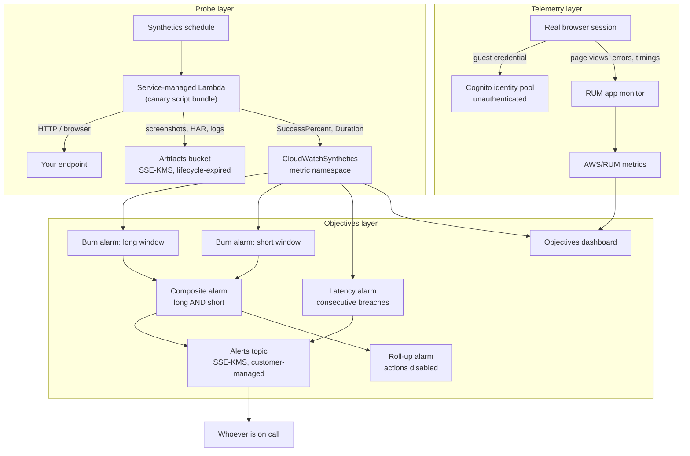

# Architecture

How the pieces of this repository fit together, what each one can observe, and —
the part that is harder to recover later — which of its shapes are the way they
are because the alternative does not work.

## The three layers

The configuration produces three kinds of thing, and they are worth keeping
distinct because they fail independently.

1. **Probes.** CloudWatch Synthetics canaries, each one a script on a schedule
   that calls a real endpoint from outside the service and records whether the
   call met its contract.
2. **Telemetry.** A CloudWatch RUM app monitor collecting what browsers on real
   sessions actually experienced.
3. **Objectives.** Dashboards and alarms derived from the probe metrics, which
   turn a stream of pass/fail runs into an availability objective with an error
   budget and a severity ladder.

Each layer is opt-in and each is created by naming the thing it observes. With
no `api_endpoint`, no `heartbeat_endpoint`, no `canaries` and no `rum_domain`,
an apply produces the artifacts bucket, its key and the canary execution role,
and nothing is being watched. That is intentional: it makes the first apply in a
new account cheap and reviewable, and it means every resource that does exist
exists because somebody named a target for it.

## Signal flow



The two signal sources never meet except on the dashboard. That is a deliberate
limit rather than an omission: real user telemetry is sampled, unauthenticated
and attacker-writable by construction, so nothing in the alerting path reads
it. It is there to answer *what did people experience*, after a probe has
already told you whether the endpoint answers.

## Probe layer

### What runs the script

A canary is not a Lambda function you own. The Synthetics service creates and
manages one on your behalf, hands it the bundle named by `canary_code`, and
invokes it on the schedule. Three consequences shape `canaries.tf`:

- **The trust policy names `lambda.amazonaws.com`,** not Synthetics. The role is
  assumed by the function the service manages, not by the service.
- **It carries no `aws:SourceAccount` or `aws:SourceArn` condition.** The Lambda
  service does not reliably pass either on the `AssumeRole` call made for a
  Synthetics-managed function, so a confused-deputy condition there does not
  tighten the trust so much as stop the canary from starting. The role is
  constrained on the permission side instead: one bucket prefix
  (`canary/*`), one log-group prefix, one metric namespace.
- **The bundle layout is not negotiable.** A Node.js canary is a zip whose
  contents sit under `nodejs/node_modules/`, and a handler of
  `api-canary.handler` means the service loads
  `nodejs/node_modules/api-canary.js`. `canary-scripts/build.sh` assembles
  exactly that, which is why the build is a script in the repository and not a
  line in a README.

### The 21-character name budget

Synthetics caps a canary *name* at 21 characters, and nothing else here is
capped that tightly. So canary names are composed from their own prefix:

```
canary name = coalesce(canary_name_prefix, "<name_prefix>-<environment>") + "-" + suffix
```

The input validations on `name_prefix` (12) and `environment` (8) cannot
guarantee the budget — their widest legal combination overflows it unaided — so
the budget is enforced by a plan-time guard that names `canary_name_prefix` as
the fix. The heartbeat canary's suffix is `hb` rather than `heartbeat` for the
same reason, while its map key stays spelled out because the key names the S3
artifact prefix, where there is no cap.

### Encryption, and the cycle it would otherwise form

The artifacts key policy grants the account root and nothing else. Every other
grant is on the principal side, including the canary execution role's. Naming
that role in the key policy would be tighter on paper and would make the key
depend on the role while the role depends on the key — reported by Terraform as
a cycle rather than as the design mistake it is.

The bucket policy denies insecure transport and deliberately **omits** a
deny-uploads-without-an-encryption-header statement. Bucket default encryption
already applies the key to every object, and Synthetics sends no
`x-amz-server-side-encryption` header on its uploads, so such a statement would
encrypt nothing extra and would break every run.

### Where the cost is

Screenshots and HAR files, not invocations. `artifact_retention_in_days` is the
lever, applied as an S3 lifecycle rule. A canary at `rate(1 minute)` writes
roughly 1,440 run artifacts a day on its own.

## Telemetry layer

RUM is gated entirely on `rum_domain`. The browser needs a credential that is
safe to publish, which is what an unauthenticated Cognito identity pool issues.
Two conditions on the guest role's trust policy carry the weight:

- the `aud` condition, without which **any** Cognito identity pool in **any**
  account could assume this role — and the role works perfectly well without
  it, which is what makes the omission easy to ship;
- the `amr` condition, without which an authenticated identity from the same
  pool could also assume the guest role, quietly widening whatever the
  authenticated role was scoped to.

`allow_classic_flow` is off. The classic flow lets a client call
`GetOpenIdToken` and then perform its own `AssumeRoleWithWebIdentity` naming
whichever role ARN it likes; the enhanced flow returns credentials for the
mapped role and nothing else, which is the property being relied on.

Everything downstream of that is an estimate. `rum_session_sample_rate` scales
the data up from the sessions that were observed, and
`rum_sessions_not_sampled` reports the complement, because a rare error is
exactly the thing a sample rate hides. `rum_guest_credentials_are_public` is
true whenever the feature is on: anyone who can load the page can publish
events to the monitor, so the data is observation and never an authority for a
billing or access decision.

## Objectives layer

### Why two alarms and a composite

Each burn-rate tier becomes two metric alarms over windows of different length
and one composite alarm that is in ALARM only while both are. The long window
decides whether the objective is genuinely in trouble; the short one decides
when to stop saying so, which is what keeps an alert from outliving the outage.

A metric alarm evaluates one metric against one threshold, so "both windows at
once" cannot be expressed inside one. Hence the composite — and a composite's
rule is a *string* naming other alarms. Terraform cannot see a dependency
inside a string, so those names are interpolated from the alarm resources
rather than rebuilt from the same expression. Written out by hand, the
composite would very likely be created before its children and rejected for
naming an alarm that does not exist, and, worse, would keep working after a
child was renamed until the next time it was evaluated.

Only the composites notify. The metric alarms underneath have
`actions_enabled = false`, so a tier pages once rather than three times. A
composite alarm has no `treat_missing_data` of its own; everything about how
silence is handled is decided on the two metric alarms.

### The alerts key

The alerts topic is encrypted with a key this configuration creates, granting
`kms:Decrypt` and `kms:GenerateDataKey*` to both `cloudwatch.amazonaws.com` and
`sns.amazonaws.com`, scoped by `aws:SourceAccount`.

This is the single most common way a correct alarm reaches nobody. An
AWS-managed key — `alias/aws/sns` — has a policy that cannot be edited, so it
can never grant CloudWatch anything: the alarm changes state, KMS refuses the
publish, and neither the alarm history nor its state gives any sign the
notification went nowhere. A guard refuses an `alias/aws/` ARN by shape. Both
service principals are needed and for different reasons: CloudWatch publishes
the notification, SNS uses the key again fanning it out to each subscription,
and a grant to CloudWatch alone leaves delivery failing one step later than
where it was fixed.

### The dashboard is built from the alarm arithmetic

Threshold lines on the success-rate graphs are read from the same map the alarms
are built from. A threshold typed onto a graph by hand stops matching its alarm
the first time the objective changes, and nothing on the graph says so.

Two mechanical facts govern `dashboards.tf`. The grid is 24 columns wide and a
row summing to more than 24 does not error — it wraps and silently rearranges —
so positions are arithmetic. And widget properties must be *absent* where they
do not apply rather than null, which `jsonencode` will happily emit; since
widgets of different kinds have different attribute sets and therefore no common
object type, each is encoded on its own and the body is assembled from strings.

### Guards that keep checking

Every plan-time guard is a `terraform_data` resource whose `input` is the set of
values being guarded. That is not decoration. A `terraform_data` with
unchanging arguments is planned once and never again, and preconditions are
only evaluated when Terraform plans an action for the resource — so a guard
with a static input quietly stops checking after the first apply.

## What this architecture cannot see

Stated here rather than only in outputs, because these are properties of the
design and not of a particular deployment.

| Blind spot | Why | Where it is reported |
|---|---|---|
| One region | Alarms, dashboards and canary metrics are regional. A single-region objective met in full is consistent with an endpoint unreachable from another continent. | `slo_scope_is_one_region` |
| Probes, not users | Every availability figure is the success rate of a synthetic probe on a fixed schedule — unweighted by traffic, blind to failures needing a real session, and equally blind to the difference between a timeout and a 500. | `slo_measures_probes_not_users` |
| The sampling floor | A canary contributes one sample per run, so the finest error rate a window can express is one failure divided by the runs it holds. | `slo_windows_undersampled`, and [the runbook](slo-runbook.md#the-sampling-floor) |
| Run vs. step duration | Both are called `Duration`. Scoped to the canary it is the whole run, which on a browser runtime begins by launching a browser. | `slo_latency_measures_harness` |
| Silence | A canary that has stopped reporting leaves its alarm in INSUFFICIENT_DATA, which notifies nobody and looks calm. | `slo_silence_not_treated_as_failure` |
| Unconfirmed delivery | An email subscription delivers nothing until its owner clicks the link, and a successful apply is not evidence that anybody has. | `alerts_subscriptions_pending_confirmation` |

## Where the code lives

| Path | Responsibility |
|---|---|
| `versions.tf`, `providers.tf`, `main.tf` | Constraints, provider wiring, the account guard rail, account context. |
| `variables.tf` | Every input, each with at least one validation block. |
| `locals.tf` | Naming, tagging, canary composition, and all objective arithmetic. |
| `canaries.tf` | Canaries, artifacts bucket, key, execution role, and the canary guards. |
| `rum.tf` | App monitor, guest identity, and the telemetry guards. |
| `dashboards.tf` | The objectives dashboard, assembled widget by widget. |
| `alarms.tf` | Burn-rate pairs, composites, latency, roll-up, topic, alerts key. |
| `outputs.tf` | What exists, and what is deliberately not the case. |
| `canary-scripts/` | What *healthy* means, plus the bundler. No runtime dependencies. |
| `tests/` | Offline suite over the scripts, their helpers, and the Terraform-to-code contract. |
